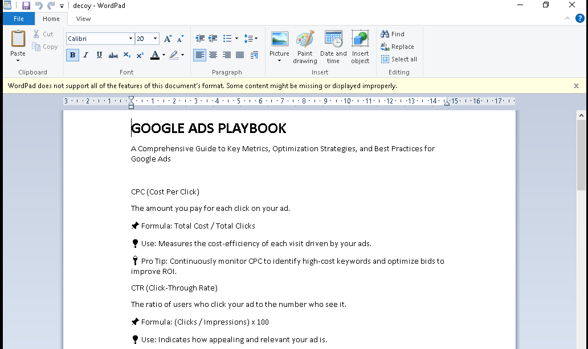
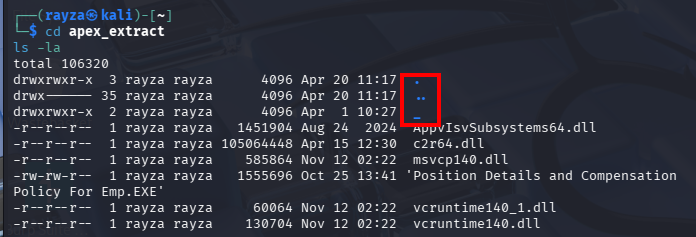
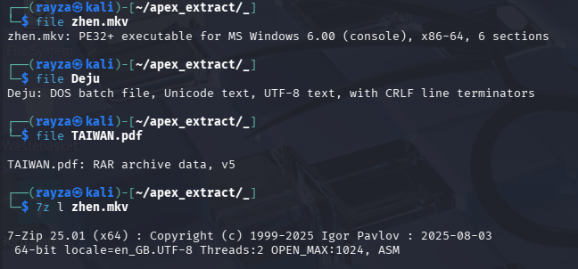
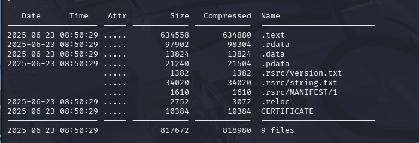
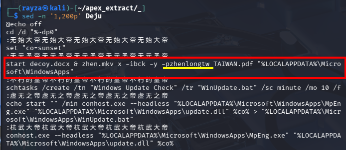
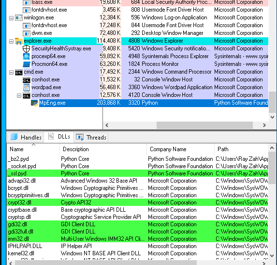
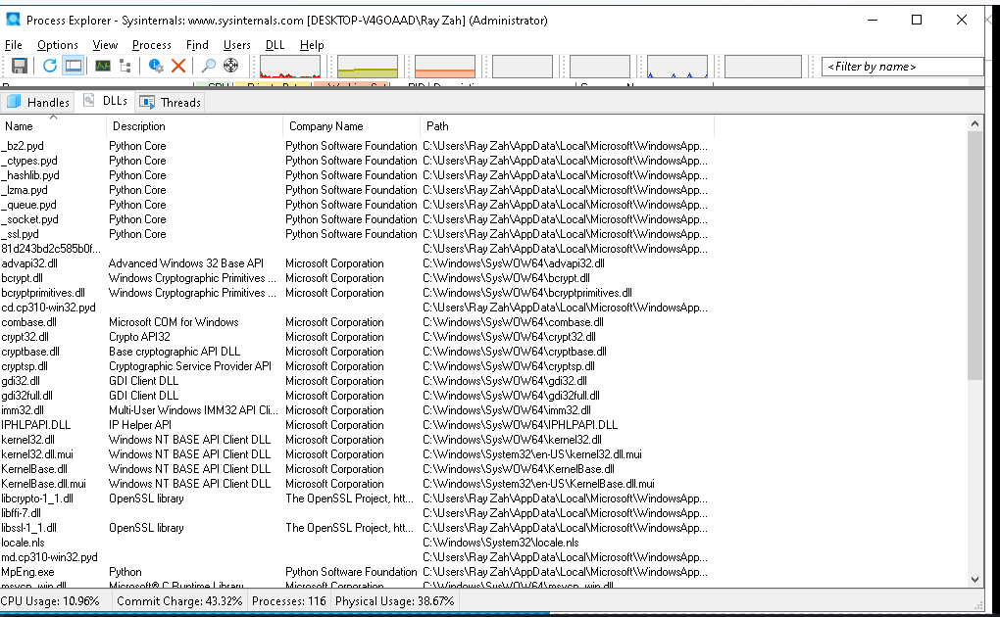
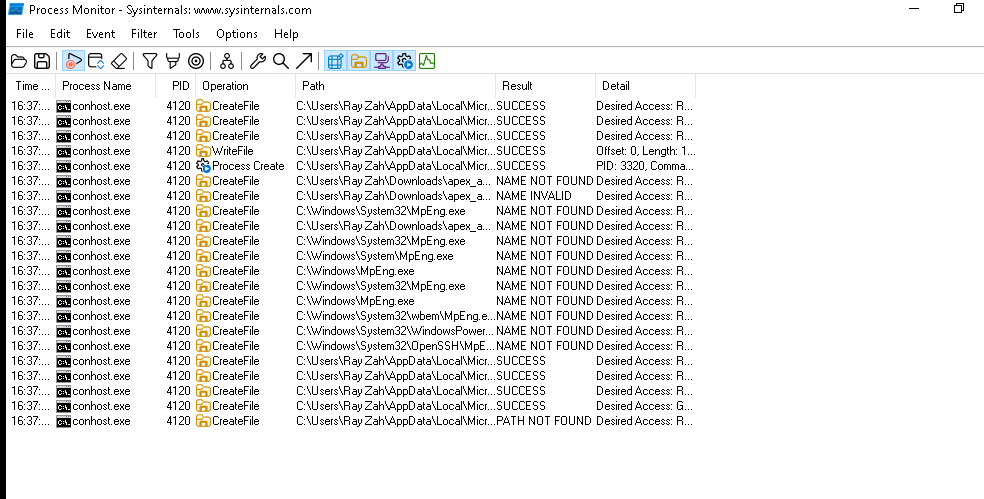
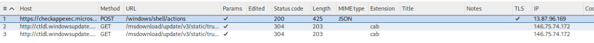

# Apex Logistics Recruitment Lure  
## Part 2 – Dynamic Analysis & Payload Behaviour

---

## Executive Summary

This part of the investigation focuses on what actually happens when the payload is executed.

In the first write-up, I looked at how the file was delivered and what it looked like statically. Going into this, I thought I was dealing with something fairly simple, probably centred around one of the DLLs.

After running it in a lab, it turned out to be a lot more layered than that.

Instead of one obvious payload, this is a **multi-stage setup** using:

- disguised files  
- a batch script to control execution  
- a password-protected archive  
- and a bundled Python environment running under a fake system process name  

I didn’t see clear command-and-control traffic during testing, but based on how it’s put together, this doesn’t look like something that just runs once and stops. It looks more like it’s setting the system up so something else can happen afterwards.

---

## Introduction

In my initial investigation into the Apex Logistics recruitment lure, I focused on the delivery chain and file structure without executing the payload.

At that point, my thinking was that the main activity would probably come from one of the DLLs in the package, maybe through sideloading.

That wasn’t completely wrong, but it didn’t explain everything.

To get a clearer picture, I moved into a lab and looked at what actually happens when the file is run using:

- Process Explorer  
- Process Monitor  
- Burp Suite  
- A Windows 10 VM ("CannonFodder")  

---

## Initial Execution – First Impressions

When the file is executed, a document opens straight away:





The aim of this document is to convince the user they have opened a legitimate document and distract them from what is going on in the background...

While the process was running I noticed a .mkv file I had earlier dismissed as a likely just a decoy video, it turned out to be a RAR file that began launching multiple .dll's.


The process ended with a file named MpEng.exe, which at first glance looked like Microsoft Defender, but the company name of Python Software Foundation made it clear that wasn't the case.


---

## Going Back to the Files

I went back to the extracted files and noticed something I’d missed earlier. The files I thought were just decoys in my earlier investigation were hidden in a `_` folder:





I'd already seen that zhen.mkv was actually a RAR, these files weren't random. 

They turned out to be the main part of the payload.

---

## File Types

Checking the real file types changed everything:



- `.mkv` → executable  
- `.pdf` → archive  
- `Deju` → batch script  

This is where it stopped looking simple.

---

## zhen.mkv 



This is actually a renamed **WinRAR command line tool**.

So not the payload itself, but something used to unpack it.

---

## Deju 



This file is a key component in delivering the payload.

It:

- extracts `TAIWAN.pdf`  
- includes the password  
- writes files into a user directory  
- sets up persistence  
- runs the next stage  

### About the Password

`TAIWAN.pdf` is password protected, and the password is written directly in this script.

So:

- the contents are hidden from quick inspection  
- but the malware can still extract everything automatically  

It’s there to slow analysis down, not to protect anything.

---

## TAIWAN.pdf 


Despite the name, this isn’t a PDF. It’s a password-protected archive.

Once unpacked, it contains a large number of files rather than one obvious payload.


Those files were:

- a full Python environment  
- standard libraries  
- compiled modules  
- and, MpEng.exe


---

## What Actually Runs

This becomes clear in Process Explorer:



A process called `MpEng.exe` appears.

Looks like Defender… but isn’t.



It’s actually running Python.

---

## Procmon Findings



Activity is happening in:

`C:\Users\<user>\AppData\Local\Microsoft\WindowsApps`

Lots of file access attempts and `NAME NOT FOUND`.

Looks like it’s checking for things as it builds out the next stage.

---

## Network Activity



I didn’t see obvious malicious traffic.

That could mean:

- it triggers later  
- it depends on conditions  
- or I didn’t run it long enough  

---

## Execution Flow

```mermaid
flowchart TD
    A[User executes lure EXE]
    A --> B[Decoy document opens]
    A --> C[Deju batch script runs]

    C --> D[zhen.mkv (WinRAR CLI) extracts archive]
    D --> E[TAIWAN.pdf unlocked using embedded password]

    E --> F[Payload files written to WindowsApps path]
    F --> G[Scheduled task created (persistence)]

    G --> H[conhost.exe launches next stage]
    H --> I[MpEng.exe process starts]

    I --> J[MpEng.exe is disguised Python runtime]
    J --> K[Python modules (.pyd) loaded]
    K --> L[Further payload logic available]

    L --> M[System left with persistent execution capability]
```

---

## What This Likely Is

Best way I can describe it:

A **multi-stage loader/backdoor setup**

Not just one payload — more like a setup for whatever comes next.

---

## Level of Impact

If this ran on a real system:

- attacker likely keeps access  
- can run more code later  
- possible data access or further compromise  

It’s quiet, not destructive, but that’s the point.

---

## Final Thoughts

This didn’t go how I expected.

I thought it was something simple, and it turned out to be much more layered once I actually ran it.

Working through it step by step helped me move from guessing based on file names to actually seeing how it fits together.

Still learning, but this one definitely helped things click.

---

## Original Investigation:

<https://github.com/Rayza-Slyce/Apex_Logistics_Recruitment_Lure_Investigation>
