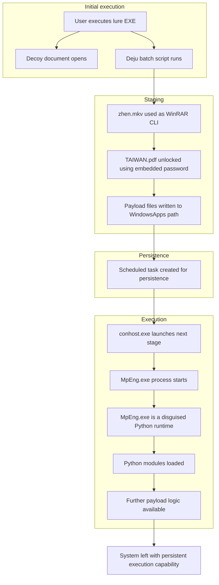

# Apex Logistics Recruitment Lure  
## Part 2 – Dynamic Analysis & Payload Behaviour

---

## Executive Summary

This part of the investigation focuses on what actually happens when 'Position Details and Compensation Policy For Emp.EXE' is executed in a controlled live enviroment.

In the first write-up, I looked at how the file was delivered and what it looked like statically. Going into this, I thought I was dealing with something fairly simple, probably centred around one of the DLLs.

After running it in a lab, it turned out to be a lot more layered than that.

Instead of one obvious payload, this is a **multi-stage setup** using:

- disguised files  
- a batch script to control execution  
- a password-protected archive  
- and a bundled Python environment running under a fake system process name  

I didn’t see clear command-and-control traffic during testing, but based on how it’s put together, this doesn’t look like something that just runs once and stops. It looks more like it’s setting the system up so something else can happen afterwards.

---

## Introduction

In my initial investigation into the Apex Logistics recruitment lure, I focused on the delivery chain and file structure without executing the payload.

At that point, my thinking was that the main activity would probably come from one of the DLLs in the package, maybe through sideloading.

That wasn’t completely wrong, but it didn’t explain everything.

To get a clearer picture, I moved into a lab and looked at what actually happens when the file is run using:

- Process Explorer  
- Process Monitor  
- Burp Suite  
- A Windows 10 VM ("CannonFodder")  

---

## Initial Execution – First Impressions

When the file is executed, a document opens straight away:

The aim of this document is to convince the user they have opened a legitimate document and distract them from what is going on in the background...

While the process was running I noticed `zhen.mkv`, a file I had seen earlier but, at that point, I had assumed was just a decoy video file based on the extension.  
However, it turned out to be a RAR archive, and once executed it began triggering the loading of multiple DLLs in the background.

The process ended with a file named MpEng.exe, which at first glance looked like Microsoft Defender, but the company name of Python Software Foundation made it clear that wasn't the case. 

It became clear this process wasn’t actually Defender at all, but a Python-based runtime executing scripts in the background.

---

## Going Back to the Files

I went back to the extracted files and noticed something I’d missed earlier. The files I thought were just decoys in my earlier investigation were hidden in a `_` folder:

I’d already seen that `zhen.mkv` wasn’t what it appeared to be, so finding these files grouped together made it clear they weren’t random decoys, they were part of the actual execution chain.

---

## File Types

Checking the real file types changed everything:

- `.mkv` → executable  
- `.pdf` → archive  
- `Deju` → batch script  

This is where it became clearer what was happening.

---

## zhen.mkv 

This is actually a renamed **WinRAR command line tool**.

So not the payload itself, but something used to unpack it.

---

## TAIWAN.pdf 

Despite the name, this isn’t a PDF. It’s a password-protected archive.

---

## Deju 

This file is the key component in delivering the payload.

It:

- executes the WordPad document
- executes zhen.mkv
- extracts `TAIWAN.pdf`  
- includes the password  
- writes files into a user directory  
- sets up persistence  
- runs the next stage

This ties everything together, Deju isn’t just another file in the archive, it’s the component orchestrating the entire execution flow.

---

I used the password to unpack Taiwan.pdf
It contains a large number of files rather than one obvious payload.

Those files were:

- a full Python environment  
- standard libraries  
- compiled modules  
- and, **MpEng.exe**

 

---

At this point, `MpEng.exe` appears to be the actual payload, masquerading as Windows Defender while running a Python-based environment.

---

## Procmon Findings

Activity is happening in:

`C:\Users\<user>\AppData\Local\Microsoft\WindowsApps`

Lots of file access attempts and `NAME NOT FOUND`.

This behaviour suggests the payload is attempting to locate or prepare its execution environment before fully committing to the next stage.

---

## Persistence 

After seeing that Deju had created a "WindowsUpdate" scheduled task, I checked Task Scheduler Library and confirmed that the created task is designed to run 'WindowsUpdate.bat' every 10 minutes indefinitely.

**The system is now persistently compromised at user level**

---

## Network Activity

No clearly malicious outbound traffic was observed during execution process.

I monitored traffic during the scheduled 'WindowsUpdate.bat' tasks and again, none was observed.
This suggests that the payload is only operating locally at this point or is using network mechanisms not captured by the proxy.

---

## Execution Flow

---

## What This Likely Is

This appears to be a **multi-stage loader/backdoor setup**, rather than a standalone payload.

The structure suggests the goal is to establish persistence and prepare the system for further activity, rather than carry out an immediate, visible action.

---

## Level of Impact

If this ran on a real system:

- attacker likely keeps access  
- can run more code later  
- possible data access or further compromise  

It’s quiet, not destructive, but that’s the point.

---

## Final Thoughts

This turned out to be quite sophisticated.

I initially thought it was something relatively straightforward, but it turned out to be much more layered once I actually ran it.

Based on the behaviour observed, this payload appears to function as a staged loader rather than a standalone attack.

The use of disguised files, controlled extraction, and scheduled task persistence suggests it is designed to maintain access and enable further execution over time.

While no clear command-and-control traffic was observed during the analysis window, this may be due to delayed execution, environmental awareness, or network behaviour not captured by the proxy.

Even without immediate visible impact, this represents a meaningful compromise of the system.

---

## Original Investigation:

<https://github.com/Rayza-Slyce/Apex_Logistics_Recruitment_Lure_Investigation>
